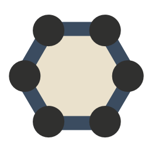

# polyball

Fast, multiplayer, physics-driven tennis in two dimensions.

## setup

1. Install `node` & `npm`.

2. Install `bower` globally.
    
        npm install -g bower

3. Clone and enter the polyball repo.

        git clone git@github.com:polyball/polyball.git

4. Install dependencies.

        npm install --production
        bower install

## run

1. Follow setup instructions.
2. Edit polyball config file, `polyball.json`.
3. Run the server.

        node polyball/Server.js

## dev

| Issues Ready | Issues In Progress | Build Status |
|--------------|--------------------|--------------|
| [![][READY_IMG]][READY_LINK] | [![][PROGRESS_IMG]][PROGRESS_LINK] | [![][TRAVIS_IMG]][TRAVIS_LINK] |

1. Install `gulp` globally.

        npm install -g gulp

2. Install dev dependencies.

        cd polyball/
        npm install

3. [WINDOWS ONLY] Replace the polyball module symlink for browserify with a windows symlink

   Start `cmd`, probably as an administrator.  Navigate to the polyball project directory and run:

        cd node_modules
        mklink /D .\polyball ..\polyball

   and confirm the symlink file replacement if prompted.  Now avoid pushing that new symlink to the repo:

       cd ..     # now in project root directory
       git update-index --skip-worktree node_modules/polyball

4. To automatically watch all client source files and build them on change,  run

        gulp watch-js

   from the project root.  The gulp process will persist and report builds and changes.
   
   

[READY_IMG]:      https://badge.waffle.io/polyball/polyball.png?label=ready&title=Ready
[READY_LINK]:     https://waffle.io/polyball/polyball
[PROGRESS_IMG]:      https://badge.waffle.io/polyball/polyball.png?label=in+progress&title=In+Progress
[PROGRESS_LINK]:     https://waffle.io/polyball/polyball
[TRAVIS_IMG]:       https://travis-ci.org/polyball/polyball.svg?branch=master
[TRAVIS_LINK]:      https://travis-ci.org/polyball/polyball
